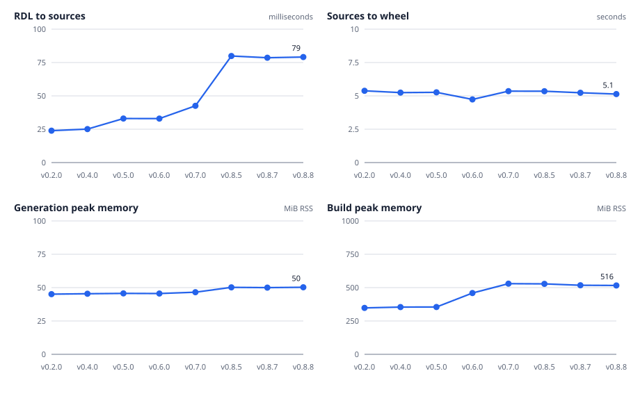
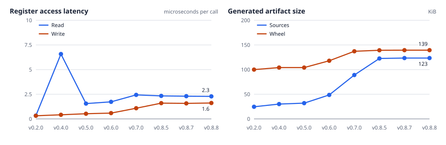
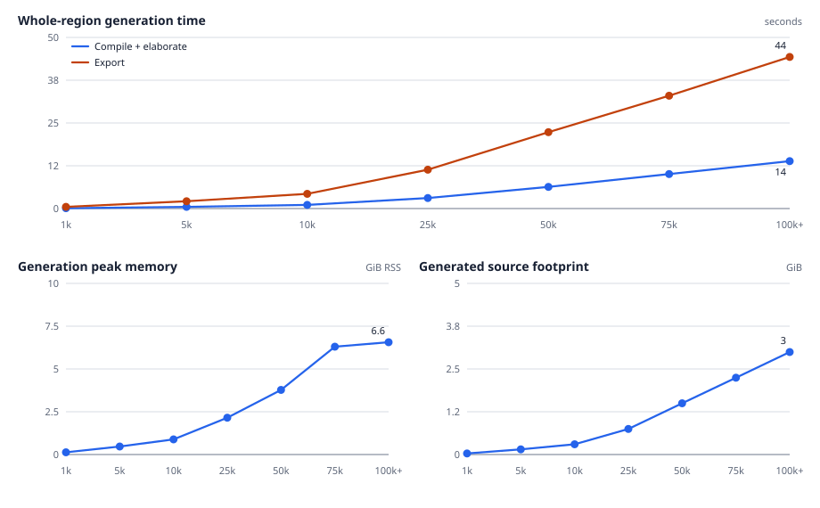
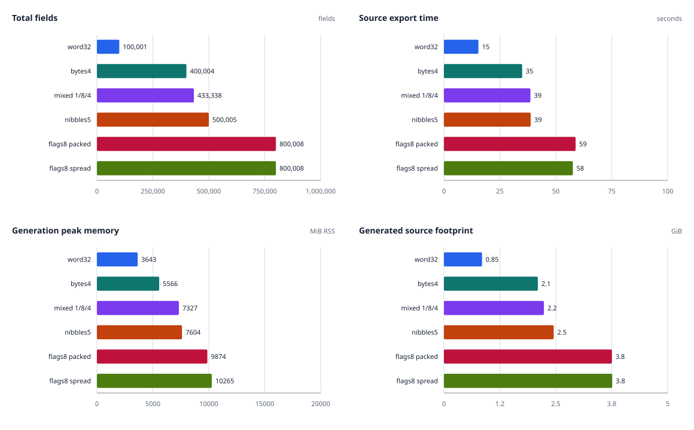
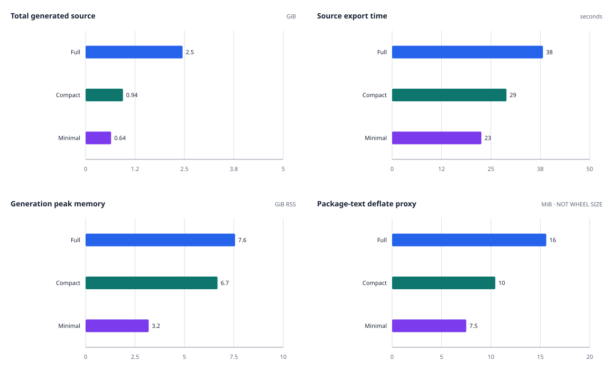
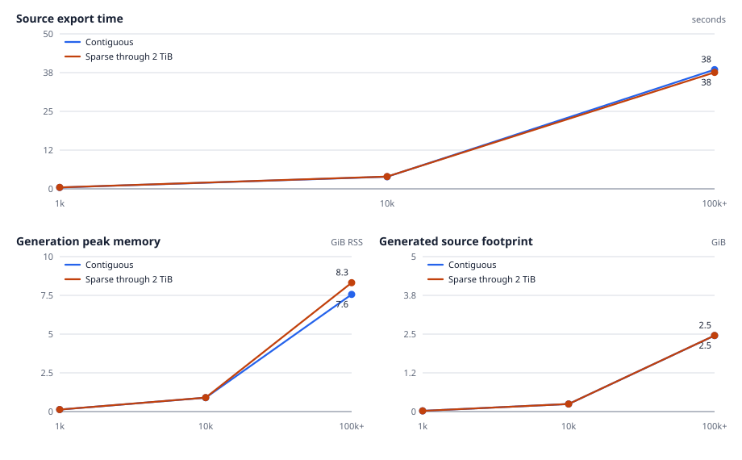

Performance evolution
=====================

Performance is one of the design inputs, alongside API coverage, generated-code
readability, package portability, and runtime ergonomics.  These plots track
those trade-offs across representative release milestones using the same
three-register SystemRDL input at every point.  The input file is unchanged
across all measured tags, so movement comes from the generator and runtime—not
from a changing register map.

.. note::
   v0.2.0 is the first comparable point: v0.1.0 does not produce a
   buildable reference package under the shared toolchain, so it is omitted
   instead of mixing missing build and runtime values into the plots.

Pipeline cost
-------------

   End-to-end generation and clean wheel-build cost for each release milestone.

The generated surface grew substantially while clean build time stayed close
to 5 seconds on the reference machine.  From v0.2.0 to v0.8.8, generation
rose from 24 ms to 79 ms and build peak RSS from 348 MiB to 516 MiB; generation
peak RSS moved much less, from 45 MiB to 50 MiB.  For this series, compiler
memory—not generation memory—accounts for the meaningful capacity change.  The
intentionally small input isolates per-release overhead; it is not a
register-count scaling study.

Runtime and artifact cost
-------------------------

   Direct register-access latency and generated artifact size for the same input.

The v0.4 read spike records an instructive intermediate design: that release
rebuilt field metadata by inspecting the generated object on every read.  v0.5
moved the layout to generated lookup tables, cutting the measured read from
6.6 microseconds to 1.6 microseconds.  Later releases add richer values,
batching, runtime services, and the broader target API; by v0.8.8, reads take
2.29 microseconds and writes take 1.61 microseconds.  The generated sources are
123 KiB (about 5× v0.2.0), while the compiled wheel is 139 KiB (about 1.4×).
Between v0.8.5 and v0.8.8, source output grows by just 0.87 KiB and the wheel by
0.25 KiB, with read/write latency effectively unchanged.

100k+ scale envelope
--------------------

Release comparisons isolate fixed overhead with a tiny input.  This separate
stress sweep measures the current exporter across the full range from 1,000
registers / 5,000 fields through 100,001 registers / 500,005 fields.  Each
register is unique, contains five fields, and occupies one contiguous 32-bit
address slot; regfiles group 256 registers only to create realistic binding
chunks.

   Current-exporter scaling over the entire contiguous synthetic address region.

The upper point validates every node and every address from ``0x0`` through
``0x61a80`` before recording a result.  Compile and elaboration take 14.197
seconds, export takes 38.459 seconds, and full-region validation takes 0.655
seconds.  The export emits 391 binding chunks and 2,634,020,286 bytes
(2.453 GiB) of source while the worker peaks at 7,742.656 MiB (7.561 GiB) RSS.

Native compilation is already the limiting stage well below that envelope.  A
clean 1,000-register / 5,000-field control build takes 99.919 seconds, peaks at
4,413.578 MiB RSS, and produces a 7,745,184-byte (7.386 MiB) wheel from
26,422,010 bytes of source, including 3,810,445 bytes of C++.  Relative to the
previous checked result, build time fell from 420.981 to 99.919 seconds
(76.27%), build peak RSS from 5,543.672 to 4,413.578 MiB (20.39%), wheel size
from 12,338,130 to 7,745,184 bytes (37.23%), total source from 32,228,788 to
26,422,010 bytes (18.02%), and C++ source from 8,672,155 to 3,810,445 bytes
(56.06%).

A 100k-register wheel build is therefore deliberately not launched as part of
the checked-in sweep: its input alone is 2.453 GiB of generated C++ and Python
source.  The benchmark keeps wheel building opt-in through
``--build-max-registers`` so dedicated build hosts can extend that boundary
without conflating an unmeasured value with the generation results.  A native
read/write or transaction sweep across all 100k registers would require that
same full build, so no 100k runtime latency is reported either.

Uneven field-distribution envelope
----------------------------------

Register count alone is not a sufficient description of exporter work.  The
field-profile sweep holds the register counts at 1,000, 10,000, and 100,001
while changing the field layout repeated within every 32-bit register.  Its
six profiles are ``word32``, ``bytes4``, ``mixed-1-8-4``, ``nibbles5``,
``flags8-packed``, and ``flags8-spread``.  The checked-in schema records each
profile's field definitions, field count, total field bits, and layout counts
alongside the timing and output measurements, so the chart can be regenerated
without reconstructing a shape from its short name.

 profiles.
   :width: 100%

   Field-profile comparison at the largest shared register count.  Each panel
   uses the same six profiles, avoiding overlapping multi-series lines.

The first panel is deliberately a field-total panel rather than a normalized
score: it separates the cost of visiting more fields from the cost associated
with a particular bit arrangement.  The other panels compare the measured
source export time, generation peak RSS, and emitted source footprint at the
largest register count all six series share.  The renderer selects that point
from the data rather than assuming that the largest requested size completed
for every future profile.

``flags8-packed`` places eight one-bit flags next to one another; the flags
occupy one compact bit range.  ``flags8-spread`` retains eight one-bit fields
but distributes them across the register bit positions.  This isolates layout
geometry from field cardinality.  The remaining profiles vary the mix and
width of regular fields, making the sweep useful for distinguishing the cost
of a field-rich map from the cost of a sparse-looking bit layout.

At 100,001 registers, ``word32`` contains 100,001 fields and emits
915,002,710 bytes in 15.426 seconds while peaking at 3,642.766 MiB RSS.  The
two eight-flag profiles each contain 800,008 fields.  Packed flags emit
4,030,934,597 bytes in 58.849 seconds and peak at 9,873.938 MiB; spread flags
emit 4,037,434,662 bytes in 57.614 seconds and peak at 10,265.375 MiB.  Spread
versus packed is therefore +0.16% source, -2.10% export time, and +3.96% peak
RSS in this run.  Those small, mixed-direction differences should be read as
similar cost, not evidence that either bit placement is intrinsically faster.

The sweep measures generated source directly, before native compilation.  It
does not report a wheel or native runtime result at the 100k+ points: compiling
the multi-gibibyte generated tree is a separate capacity experiment, and a
missing wheel must not be interpreted as a zero-sized or successful build.
As with the contiguous scale envelope, wheel builds stay opt-in on dedicated
hosts; source, export time, and generation RSS remain the comparable
checked-in observations.

The field-profile names are benchmark fixtures only.  They describe generated
SystemRDL inputs and are not exporter CLI choices.  Output artifact selection
uses the controls below; it never changes the fields in the input design.

Generated-output profiles
-------------------------

``--output-profile full|compact|minimal`` selects a base artifact set.
``full`` preserves the historical output: stubs, schema, interrupt and alias
metadata, and legacy root-level mirrors are all enabled.  ``compact`` keeps
``.pyi`` stubs plus alias and interrupt runtime metadata, but disables the
offline schema and root mirrors.  ``minimal`` is an explicit opt-out profile:
it disables all five optional artifact groups and retains the package and
native build inputs required to build and use the generated module.

Every profile default can be overridden symmetrically with
``--gen-pyi`` / ``--no-gen-pyi``, ``--gen-schema`` / ``--no-gen-schema``,
``--gen-interrupts`` / ``--no-gen-interrupts``, and
``--gen-aliases`` / ``--no-gen-aliases``.  Root copies use
``--root-mirror`` / ``--no-root-mirror``.  For example:

.. code-block:: console

   peakrdl pybind11 design.rdl -o build/generated --output-profile compact
   peakrdl pybind11 design.rdl -o build/generated --output-profile compact \
     --gen-schema --no-gen-pyi

PeakRDL's native ``peakrdl.toml`` configuration uses flat keys in the exporter
table.  Explicit CLI switches override these values for one invocation.

.. code-block:: toml

   [pybind11]
   output_profile = "compact"
   gen_pyi = true
   gen_schema = false
   gen_interrupts = true
   gen_aliases = true
   root_mirror = false

   Generated-output cost at the largest register count shared by all profiles.
   The package-text deflate proxy is explicitly not a wheel-size measurement.

.. list-table:: Output-profile results at 100,001 registers
   :header-rows: 1
   :widths: 26 18 28 28

   * - Metric
     - Full
     - Compact
     - Minimal
   * - Total generated source
     - 2,634,038,430 B
     - 1,014,464,372 B (61.49% less)
     - 692,540,222 B (73.71% less)
   * - Source export
     - 38.153140 s
     - 28.927820 s (24.18% less)
     - 22.577399 s (40.82% less)
   * - Generation peak RSS
     - 7,743.40625 MiB
     - 6,833.625 MiB (11.75% less)
     - 3,269.609375 MiB (57.78% less)
   * - Package-text deflate proxy
     - 16,357,327 B
     - 10,942,958 B (33.10% less)
     - 7,869,668 B (51.89% less)

The C++ portion is fixed at exactly 376,237,731 bytes in all three profiles;
the savings come from optional Python, schema, stub, and mirrored artifacts.
The compressed package-text value is a deterministic deflate proxy for
comparing emitted text, not a wheel size.  No 100k wheel was built.  Separately,
shared native base-method compaction reduced the measured 1,000-register C++
output from 8,672,155 to 3,810,445 bytes, a 56.1% reduction; that common saving
applies before the output profiles select optional artifacts.

Sparse 2 TiB address span
-------------------------

The same 1,000, 10,000, and 100,001-register shapes were also spread evenly
from ``0x0`` through ``0x200_0000_0000`` (2 TiB).  The benchmark checks the
absolute address of every generated register, including the exact upper
endpoint, rather than inferring the span from the first and last nodes.

   Sparse address distance has little effect once register and field counts are held constant.

At the upper point, only 400,004 bytes contain registers within a
2,199,023,255,556-byte inclusive region: an address density of
``1.819e-7``, or about ``0.0000182%``.  Compile and elaboration take 14.260
seconds, full-address validation takes 0.658 seconds, and export takes 37.572
seconds.  The worker peaks at 8,518.797 MiB (8.319 GiB) RSS and emits
2,637,284,035 bytes (2.456 GiB) of source, including 376,768,256 bytes of C++,
in the same 391 binding chunks.  The corresponding contiguous export takes
38.459 seconds, peaks at 7,742.656 MiB (7.561 GiB), and emits 2,634,020,286
bytes (2.453 GiB), including 376,223,493 bytes of C++.

Sparse versus contiguous is -2.31% export time, +10.02% peak RSS, +0.124%
total source, and +0.145% C++ source in this run.  The one-run timing and memory
differences are not performance guarantees; the nearly identical emitted
footprints show that neither memory nor output grows in proportion to the
address holes.

This result shows that generator cost follows populated node and field count,
not the numeric address span.  Generated access paths use 64-bit addresses, so
the 2 TiB endpoint is representable.  It does not imply that a contiguous 2 TiB
``MmapMaster`` backing is practical or portable, nor does it supply native
transaction latency at the 100k point: that measurement still requires the
full multi-gibibyte source build described above.

Methodology and reproduction
----------------------------

These are directional comparisons, not performance guarantees.  Absolute
times depend on the host, Python, compiler, CMake, pybind11, and system load.
All releases in a graph are collected serially in one run on the same host.

The benchmark code lives in the repository:

* `Release-history collector <https://github.com/arnavsacheti/PeakRDL-pybind11/blob/main/benchmarks/collect_release_metrics.py>`_
* `100k, sparse-region, and field-profile runner <https://github.com/arnavsacheti/PeakRDL-pybind11/blob/main/benchmarks/benchmark_scale_envelope.py>`_
* `Output-profile runner <https://github.com/arnavsacheti/PeakRDL-pybind11/blob/main/benchmarks/benchmark_output_profiles.py>`_
* `Scale correctness and stress tests <https://github.com/arnavsacheti/PeakRDL-pybind11/blob/main/benchmarks/test_scale_envelope.py>`_
* `Checked benchmark results <https://github.com/arnavsacheti/PeakRDL-pybind11/tree/main/benchmarks/results>`_
* `Documentation graph renderer <https://github.com/arnavsacheti/PeakRDL-pybind11/blob/main/benchmarks/render_release_metrics.py>`_

.. list-table:: Measurement definitions
   :header-rows: 1
   :widths: 24 76

   * - Metric
     - Definition
   * - Generation
     - Median of seven clean SystemRDL compile, elaborate, and export runs.
   * - Build
     - One clean Release wheel build through ``python -m build`` and Ninja.
   * - Read / write
     - Median of seven 20,000-operation runs through the same Python-backed master; reported per call.
   * - Source size
     - All files emitted by the exporter before any build files are created.
   * - Wheel size
     - Size of the platform wheel produced by the clean build.
   * - Peak memory
     - Maximum resident set size for the generation worker or build process tree; includes tool and interpreter baselines.
   * - 100k+ sweep
     - One clean worker per size; verifies register count, field count, first address, last address, and contiguous region size before exporting.
   * - Sparse sweep
     - One clean worker per size; verifies every absolute register address over the exact 2 TiB span, occupied bytes, and address density before exporting.
   * - Field-profile sweep
     - One clean worker per profile and size; records the declared repeated field layouts plus total fields, total field bits, source export time, generation peak RSS, source bytes, and binding chunks.  The comparison figure selects the largest register count shared by every profile.
   * - Output-profile sweep
     - One clean worker per output profile and size over the same ``nibbles5`` input; records the effective output booleans, complete manifest, overlapping source categories, export time, and generation peak RSS.
   * - Package-text deflate proxy
     - Level-9 deflate size of named text files inside the generated Python package.  It is deterministic comparison data and explicitly not a wheel size.

The release-history, dense, and sparse measurements use an Apple M3 Max with
macOS 26.6, CPython 3.13.2, Apple Clang, CMake 4.3.3, pybind11 3.0.4,
scikit-build-core 0.10.7, and Ninja 1.13.  The field- and output-profile
matrices are generation-only runs: their metadata records pybind11,
scikit-build-core, and Ninja as unavailable because those native-build-only
packages were not invoked and no wheels were built.

The four current envelope payloads record base commit
``a492151271520ddafc275119b8f2c83bef0d632a`` with ``git_dirty=true``: the
measurements intentionally include the code-generation changes present in the
benchmark worktree.  Recreate the JSON and SVGs with:

.. code-block:: console

   uv run --python 3.13 --group benchmark --with pybind11==3.0.4 \
     --with scikit-build-core==0.10.7 --with ninja \
     python benchmarks/collect_release_metrics.py
   uv run --python 3.13 --group benchmark --with pybind11==3.0.4 \
     --with scikit-build-core==0.10.7 --with ninja \
     python benchmarks/benchmark_scale_envelope.py --build-max-registers 1000
   uv run python benchmarks/benchmark_scale_envelope.py \
     --sizes 1000 10000 100001 --max-address 0x200_0000_0000 \
     --output benchmarks/results/sparse_scale_envelope.json
   uv run --python 3.13 python benchmarks/benchmark_scale_envelope.py \
     --sizes 1000 10000 100001 \
     --field-profiles word32 bytes4 mixed-1-8-4 nibbles5 flags8-packed flags8-spread \
     --output benchmarks/results/field_profile_envelope.json
   uv run --python 3.13 python benchmarks/benchmark_output_profiles.py \
     --sizes 1000 10000 100001 --profiles full compact minimal \
     --output benchmarks/results/output_profile_envelope.json
   uv run --python 3.13 python benchmarks/render_release_metrics.py

The opt-in pytest stress case recreates the 100,001-register export and its
structural assertions:

.. code-block:: console

   PEAKRDL_RUN_100K_STRESS=1 uv run --group benchmark \
     pytest benchmarks/test_scale_envelope.py -m stress

Raw observations and environment metadata live in
``benchmarks/results/release_history.json`` and
``benchmarks/results/scale_envelope.json``, with the sparse observations in
``benchmarks/results/sparse_scale_envelope.json`` and the uneven-field results
in ``benchmarks/results/field_profile_envelope.json``.  Output-selection
observations live in ``benchmarks/results/output_profile_envelope.json``.  Keep
those files and the generated SVGs in the same change when refreshing the
figures.
